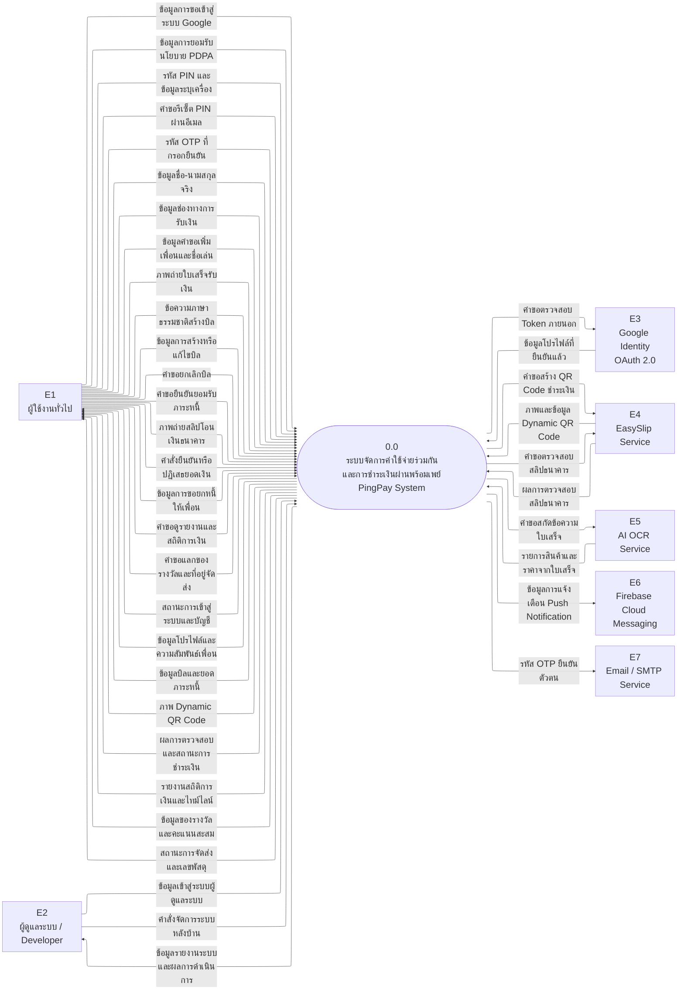

# DFD - LEVEL 0

```mermaid.js
---
config:
  layout: elk
  elk:
    mergeEdges: false
    nodePlacementStrategy: NETWORK_SIMPLEX
  themeVariables:
    fontSize: 30px
---
flowchart LR

    E1["E1<br>ผู้ใช้งานทั่วไป"]
    E2["E2<br>ผู้ดูแลระบบ / Developer"]
    E3["E3<br>Google Identity<br>OAuth 2.0"]

    P0(["<div style='width:500px; padding:40px 20px'>0.0<br>ระบบจัดการค่าใช้จ่ายร่วมกัน<br>และการชำระเงินผ่านพร้อมเพย์<br>PingPay System"])

    E4["E4<br>EasySlip Service"]
    E5["E5<br>AI OCR Service"]
    E6["E6<br>Firebase Cloud Messaging"]
    E7["E7<br>Email / SMTP Service"]

    %% =========================
    %% E1 : ผู้ใช้งาน
    %% =========================

    E1 -- "ข้อมูลการขอเข้าสู่ระบบ Google" --> P0
    E1 -- "ข้อมูลการยอมรับนโยบาย PDPA" --> P0
    E1 -- "รหัส PIN และข้อมูลระบุเครื่อง" --> P0
    E1 -- "คำขอรีเซ็ต PIN ผ่านอีเมล" --> P0
    E1 -- "รหัส OTP ที่กรอกยืนยัน" --> P0
    E1 -- "ข้อมูลชื่อ-นามสกุลจริง" --> P0
    E1 -- "ข้อมูลช่องทางการรับเงิน" --> P0
    E1 -- "ข้อมูลคำขอเพิ่มเพื่อนและชื่อเล่น" --> P0
    E1 -- "ภาพถ่ายใบเสร็จรับเงิน" --> P0
    E1 -- "ข้อความภาษาธรรมชาติสร้างบิล" --> P0
    E1 -- "ข้อมูลการสร้างหรือแก้ไขบิล" --> P0
    E1 -- "คำขอยกเลิกบิล" --> P0
    E1 -- "คำขอยืนยันยอมรับภาระหนี้" --> P0
    E1 -- "ภาพถ่ายสลิปโอนเงินธนาคาร" --> P0
    E1 -- "คำสั่งยืนยันหรือปฏิเสธยอดเงิน" --> P0
    E1 -- "ข้อมูลการขอยกหนี้ให้เพื่อน" --> P0
    E1 -- "คำขอดูรายงานและสถิติการเงิน" --> P0
    E1 -- "คำขอแลกของรางวัลและที่อยู่จัดส่ง" --> P0

    P0 -- "สถานะการเข้าสู่ระบบและบัญชี" --> E1
    P0 -- "ข้อมูลโปรไฟล์และความสัมพันธ์เพื่อน" --> E1
    P0 -- "ข้อมูลบิลและยอดภาระหนี้" --> E1
    P0 -- "ภาพ Dynamic QR Code" --> E1
    P0 -- "ผลการตรวจสอบและสถานะการชำระเงิน" --> E1
    P0 -- "รายงานสถิติการเงินและไทม์ไลน์" --> E1
    P0 -- "ข้อมูลของรางวัลและคะแนนสะสม" --> E1
    P0 -- "สถานะการจัดส่งและเลขพัสดุ" --> E1

    %% =========================
    %% E2 : Admin
    %% =========================

    E2 -- "ข้อมูลเข้าสู่ระบบผู้ดูแลระบบ" --> P0
    E2 -- "คำสั่งจัดการระบบหลังบ้าน" --> P0
    P0 -- "ข้อมูลรายงานระบบและผลการดำเนินการ" --> E2

    %% =========================
    %% E3 : Google OAuth
    %% =========================

    P0 -- "คำขอตรวจสอบ Token ภายนอก" --> E3
    E3 -- "ข้อมูลโปรไฟล์ที่ยืนยันแล้ว" --> P0

    %% =========================
    %% E4 : EasySlip
    %% =========================

    P0 -- "คำขอสร้าง QR Code ชำระเงิน" --> E4
    E4 -- "ภาพและข้อมูล Dynamic QR Code" --> P0
    P0 -- "คำขอตรวจสอบสลิปธนาคาร" --> E4
    E4 -- "ผลการตรวจสอบสลิปธนาคาร" --> P0

    %% =========================
    %% E5 : OCR
    %% =========================

    P0 -- "คำขอสกัดข้อความใบเสร็จ" --> E5
    E5 -- "รายการสินค้าและราคาจากใบเสร็จ" --> P0

    %% =========================
    %% E6 : FCM
    %% =========================

    P0 -- "ข้อมูลการแจ้งเตือน Push Notification" --> E6

    %% =========================
    %% E7 : Email
    %% =========================

    P0 -- "รหัส OTP ยืนยันตัวตน" --> E7

    %% =========================
    %% SIZE / STYLE
    %% =========================

    style P0 font-size:30px
```
