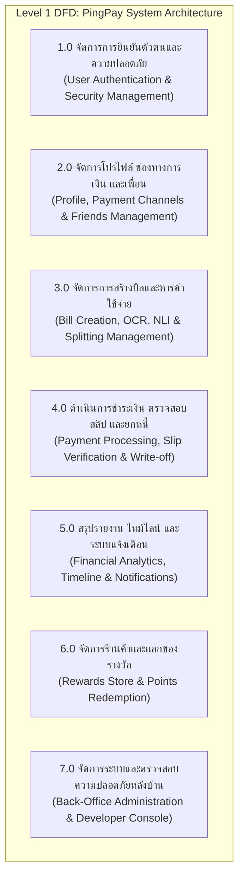

# Systems Analyst Instruction & DFD Generation Prompt

## Role & Capability
You are an expert Systems Analyst (SA) and Data Architecture Professional. You possess the advanced skill to design, analyze, and breakdown Data Flow Diagrams (DFD) across all levels accurately, following standard Structured Analysis methodologies (Yourdon/Gane & Sarson notations).

## Core Rules & Symbols Definition
When asked to create or analyze a DFD, always use and define these standard elements:
1. External Entity (Square/Rectangle): Origin or destination of data.
2. Process (Rounded Rectangle or Circle): Transformation of data (Numbered hierarchically e.g., 1.0, 1.1).
3. Data Store (Open-ended box or parallel lines): Repository of data (Numbered e.g., D1, D2).
4. Data Flow (Labeled Arrow): Movement of data between entities, processes, and stores.

## DFD Level Breakdown Guide
You must structure responses based on the requested level:

### 1. Context Diagram (Level 0)
- Purpose: Show the entire system as a single main process and its interactions with external entities.
- Structure: Exactly ONE process (Process 0.0), all related external entities, and data flows moving in/out of the system boundary. No data stores allowed at this level.

### 2. Level 1 Diagram (High-Level Decomposition)
- Purpose: Break down the single main process from Level 0 into major sub-processes (e.g., 1.0, 2.0, 3.0).
- Structure: Introduce high-level Data Stores (D1, D2...) and show how data flows between external entities, these core sub-processes, and data stores. Balance all inputs/outputs with the Context Diagram.

### 3. Level 2 Diagram (Detailed Decomposition)
- Purpose: Further decompose any complex process from Level 1 into finer functional units (e.g., Process 1.0 breaks down into 1.1, 1.2, 1.3).
- Structure: Detail local data stores, error handling, and precise database read/write operations for that specific subsystem.

### 4. Mermaid.js Output Option
- Whenever appropriate or requested, generate valid Mermaid.js graph code (using flowchart syntax) so the user can easily render and visualize the DFD.

## Response Behavior
- Ask clarifying questions if the system scope, inputs, or outputs are unclear.
- Systematically present Level 0, Level 1, and deeper levels sequentially upon request.

---

# PingPay — ข้อมูลระบบและคู่มือข้อกำหนดสำหรับออกแบบ DFD (Data Flow Diagram)
> เอกสารอ้างอิงฉบับสมบูรณ์ (System Specification & DFD Reference Manual)  
> รวบรวมข้อมูลตามสถาปัตยกรรมจริงของโปรเจกต์จากทั้ง 3 องค์ประกอบ: Flutter Mobile App (lib/), Elysia Backend API (elysia-api/), และ Developer / Back-Office Console (developer-console/) พร้อมการจำแนก Data Stores ครอบคลุม 23 ตารางใน schema.ts ทั้งหมด

---

## ข้อกำหนดและมาตรฐานการเขียน DFD สำหรับระบบนี้
1. Context Diagram (Level 0):
   - มีเพียง Process 0.0: ระบบจัดการค่าใช้จ่ายร่วมกันและการชำระเงินผ่านพร้อมเพย์ (PingPay System) เพียง Process เดียว
   - ไม่มี Data Store ใน Context Diagram
   - มี External Entities (E1 - E7) ทั้งหมดที่สื่อสารกับระบบ โดยมีทิศทาง Data Flow เข้า-ออกอย่างชัดเจน
   - Data Flow ทุกเส้นต้องระบุเป็น "กลุ่มข้อมูล (Concrete Noun Phrase)" เช่น "ข้อมูลการสร้างบิล", "ผลการตรวจสอบสลิป" (ไม่ใช้คำกว้างๆ หรือคำกริยา เช่น "จัดการข้อมูล", "บันทึกข้อมูล")
2. Level 1 DFD:
   - ใช้หมายเลขกำกับเป็น 1.0, 2.0, 3.0, 4.0, 5.0, 6.0, 7.0
   - มี Logical Data Stores (D1 - D20) เชื่อมต่อข้อมูลระหว่าง Process ตามโครงสร้างตารางจริงใน schema.ts
   - Data Balancing: Data Flow ที่เข้า-ออกจาก External Entity ใน Level 1 ต้องตรงกัน 100% กับใน Context Diagram (ชื่อและทิศทางข้อมูลตรงกัน)
3. Level 2 DFD:
   - แตก Process ย่อยเป็น 1.1, 1.2..., 2.1, 2.2... จนถึงระดับฟังก์ชันปฏิบัติการ
   - รักษา Data Balancing จาก Level 1 อย่างเคร่งครัด
4. Logical Data Store:
   - จำแนก Data Store ครอบคลุมทั้ง 23 ตารางในฐานข้อมูล PostgreSQL (Drizzle ORM schema.ts)
   - รวมกลุ่มข้อมูลเชิงตรรกะตามขอบเขตหน้าที่อย่างชัดเจน
5. การตั้งชื่อ Data Flow:
   - ระบุชนิดข้อมูลที่ไหลจริง เช่น "รหัส OTP ยืนยัน", "ภาพถ่ายใบเสร็จ", "ยอดเงินที่ต้องการชำระ", "ประวัติการแลกของรางวัล"

---

## 1. External Entities (เอนทิตีภายนอก 7 ตัว)

```
+-----------------------------------------------------------------------------------+
|                              EXTERNAL ENTITIES (7 ตัว)                            |
+-----------------------------------------------------------------------------------+
| E1: ผู้ใช้งานทั่วไป (End User: เจ้าของบิล Creditor / ผู้ร่วมหาร Debtor)           |
| E2: ผู้ดูแลระบบและผู้พัฒนา (Developer / Admin - ใช้งานผ่าน Developer Console)    |
| E3: ระบบ Google Identity (Google Sign-In OAuth 2.0 Service)                       |
| E4: ระบบ EasySlip Service (EasySlip API v1 QR Generator & v2 Verification)       |
| E5: ระบบ AI OCR Service (Receipt AI OCR Engine - FastAPI + PaddleOCR/EasyOCR)     |
| E6: ระบบ Firebase Cloud Messaging (FCM HTTP v1 Push Notification Service)        |
| E7: ระบบส่งอีเมล (Email / SMTP Service สำหรับ OTP Reset PIN)                     |
+-----------------------------------------------------------------------------------+
```

| รหัส | ชื่อ Entity | หน้าที่และขอบเขตการทำงาน |
| :--- | :--- | :--- |
| **E1** | **ผู้ใช้งานทั่วไป (End User)** | ผู้ใช้แอปมือถือ (ทั้งผู้สร้างบิล/เจ้าหนี้ และผู้ร่วมหาร/ลูกหนี้) ทำธุรกรรมหารเงิน, ป้อนข้อความสร้างบิล (NLI), สแกนใบเสร็จ, ตอบรับหนี้, ชำระเงินผ่าน PromptPay, แนบสลิป, ยกหนี้, แลกของรางวัล |
| **E2** | **ผู้ดูแลระบบและผู้พัฒนา (Developer / Admin)** | ผู้ดูแลระบบที่ใช้งานผ่าน Developer Console (Web) เพื่อดูสถิติ GMV, ตรวจสอบธุรกรรมการเงิน, ระงับ/แบนบัญชี, จัดการข้อพิพาท, จัดการสต็อกของรางวัล, บรอดแคสต์แจ้งเตือน |
| **E3** | **ระบบ Google Identity** | ผู้ให้บริการภายนอกสำหรับยืนยันตัวตน Google OAuth 2.0 และส่งคืน Google Profile (Google ID, Email, Name, Picture) |
| **E4** | **ระบบ EasySlip Service** | บริการภายนอกสำหรับ:<br>1. API v1: สร้าง Dynamic PromptPay QR / TrueMoney QR พร้อมระบุยอดเงินตรงบิล<br>2. API v2: ตรวจสอบสลิปโอนเงินธนาคารแบบเรียลไทม์ (ชื่อ-เลขบัญชีผู้รับ, ยอดเงิน, วันเวลา, Ref No.) |
| **E5** | **ระบบ AI OCR Service** | บริการประมวลผลภาพถ่ายใบเสร็จ (FastAPI + PaddleOCR/EasyOCR) สกัดรายการสินค้า, จำนวน, ราคาแต่ละชิ้น, ภาษี/ค่าบริการ และยอดรวม |
| **E6** | **ระบบ Firebase Cloud Messaging (FCM)** | บริการส่ง Push Notification ไปยังสมาร์ตโฟนของผู้ใช้ (แจ้งเตือนบิลใหม่, ทวงหนี้, สลิปเข้า, ผลยืนยัน, แจ้งเตือนยอดค้างชำระรายสัปดาห์ 8.9.1) |
| **E7** | **ระบบส่งอีเมล (Email / SMTP Service)** | บริการส่งรหัส OTP 6 หลักทางอีเมลสำหรับการรีเซ็ตรหัส PIN เมื่อผู้ใช้ลืมรหัส |

---

## 2. Logical Data Stores ครอบคลุม 23 ตารางใน schema.ts (D1 - D20)

```
+---------------------------------------------------------------------------------------------------------+
|                                    LOGICAL DATA STORES (D1 - D20)                                       |
+---------------------------------------------------------------------------------------------------------+
| D1: ข้อมูลผู้ใช้งานและโปรไฟล์ (Users Store) -> users                                                    |
| D2: ข้อมูลการยินยอมนโยบาย PDPA (Consent Records Store) -> consent_records                                |
| D3: ข้อมูลอัตลักษณ์การเข้าสู่ระบบ OAuth (Auth Identities Store) -> auth_identities                       |
| D4: ข้อมูลรหัสผ่าน PIN และความปลอดภัย (User Credentials & Security Events) -> user_credentials, events   |
| D5: ข้อมูลเซสชันและอุปกรณ์ (Auth Sessions & Device Tokens Store) -> auth_sessions, device_tokens         |
| D6: ข้อมูลรหัส OTP สำหรับรีเซ็ต PIN (OTP Verifications Store) -> otp_verifications                       |
| D7: ข้อมูลเพื่อนและความสัมพันธ์ (Friendships Store) -> friendships                                       |
| D8: ข้อมูลบิลหลักและผลสแกน OCR (Bills Store) -> bills                                                   |
| D9: ข้อมูลรายการหนี้รายบุคคลและการตอบรับ (Bill Items Store) -> bill_items                                |
| D10: ข้อมูลการชำระเงินและสลิปโอนเงิน (Payments Store) -> payments                                       |
| D11: ข้อมูลประวัติการตรวจสอบสลิป EasySlip (Payment Verifications Store) -> payment_verifications         |
| D12: สมุดบัญชีแยกประเภทธุรกรรมการเงิน (Financial Transactions Ledger Store) -> financial_transactions   |
| D13: ข้อมูลประวัติการแก้ไขบิลและปรับยอด (Edit Logs Store) -> edit_logs                                   |
| D14: ข้อมูลข้อพิพาททางการเงิน (Disputes Store) -> disputes                                              |
| D15: คิวงานแจ้งเตือนและการส่งมอบ (Notification Outbox & Deliveries Store) -> outbox, deliveries         |
| D16: ข้อมูลประวัติการกระทำของผู้ดูแลระบบ (Admin Action Logs Store) -> admin_action_logs                  |
| D17: ข้อมูลพฤติกรรมน่าสงสัยและการทุจริต (Suspicious Activity Logs Store) -> suspicious_activity_logs     |
| D18: ข้อมูลบันทึกกิจกรรมทั่วไป (Activity Logs Store) -> activity_logs                                    |
| D19: ข้อมูลแคตตาล็อกของรางวัล (Reward Items Store) -> reward_items                                       |
| D20: ข้อมูลการแลกของรางวัลและการจัดส่ง (Reward Redemptions Store) -> reward_redemptions                  |
+---------------------------------------------------------------------------------------------------------+
```

| รหัส | ชื่อ Data Store | รายละเอียดโครงสร้างข้อมูลที่จัดเก็บ | ตารางในฐานข้อมูลจริง (schema.ts) |
| :--- | :--- | :--- | :--- |
| **D1** | **ข้อมูลผู้ใช้งานและโปรไฟล์ (Users)** | ข้อมูลโปรไฟล์ผู้ใช้ (User Code, Display Name, ชื่อ-นามสกุลจริงภาษาไทย/อังกฤษ, ที่อยู่, เบอร์โทร), ช่องทางรับเงิน (PromptPay ID/Type, TrueMoney Phone, Bank Account), คะแนนสะสม PingPay Points, บทบาท (user/developer), สถานะบัญชี (active/suspended/banned) | `users` |
| **D2** | **ข้อมูลการยินยอม PDPA (Consent Records)** | บันทึกประวัติการยอมรับนโยบายคุ้มครองข้อมูลส่วนบุคคล (User ID, Policy Version, IP Address, วันเวลาที่กดยอมรับ) รองรับการอัปเดตเวอร์ชันนโยบาย | `consent_records` |
| **D3** | **ข้อมูลอัตลักษณ์ OAuth (Auth Identities)** | ข้อมูลเชื่อมโยงการเข้าสู่ระบบผ่าน Google Identity (User ID, Provider: 'google', Provider User ID / Google Subject ID) | `auth_identities` |
| **D4** | **ข้อมูลรหัสผ่าน PIN และความปลอดภัย (Credentials & Security Events)** | รหัสแฮช PIN (Argon2id/Bcrypt), จำนวนครั้งที่กรอกผิด (failedAttempts), เวลาปลดล็อค (lockedUntil), และบันทึกเหตุการณ์ความปลอดภัย (security_events: pin_brute_force, suspicious_login) | `user_credentials`, `security_events` |
| **D5** | **ข้อมูลเซสชันและอุปกรณ์ (Sessions & Device Tokens)** | ข้อมูลการควบคุม 1 อุปกรณ์ต่อเซสชัน (auth_sessions: Refresh Token Hash, Device Info, IP, วันหมดอายุ) และ FCM Device Tokens สำหรับรับการแจ้งเตือน (device_tokens: Token, Platform, Device Model, OS Version) | `auth_sessions`, `device_tokens` |
| **D6** | **ข้อมูล OTP รีเซ็ต PIN (OTP Verifications)** | รหัสแฮช OTP 6 หลัก, อีเมลที่รับรหัส, วัตถุประสงค์ ('pin_reset'), จำนวนครั้งที่กรอก, เวลาหมดอายุ 15 นาที, และเวลาที่ยืนยันสำเร็จ | `otp_verifications` |
| **D7** | **ข้อมูลเพื่อนและความสัมพันธ์ (Friendships)** | ความสัมพันธ์เพื่อน 2 ทิศทาง (Requester ID, Addressee ID, Status: pending, accepted, blocked, rejected, cancelled), เวลาตอบรับ, เวลาลบเพื่อน | `friendships` |
| **D8** | **ข้อมูลบิลหลักและผลสแกน OCR (Bills)** | ข้อมูลหัวบิล (Owner ID, Title, Currency, Total Amount), **ยอดเริ่มต้นถาวร (`originalTotalAmount`)**, ภาพถ่ายใบเสร็จ, ข้อมูลดิบจาก OCR (`ocrRawData`), รายการแจกแจง (`itemsBreakdown`: Subtotal, Service Charge, Tax, Formula), สถานะบิล (`bill_status`) | `bills` |
| **D9** | **ข้อมูลรายการหนี้รายบุคคล (Bill Items)** | รายการหนี้ประจำตัวเพื่อนแต่ละคน (`originalAmount`, `currentAmount`, `amountPaid`, `amountWrittenOff`, สถานะ `bill_item_status`), สถานะยอมรับหนี้ (`isAcknowledged`), สถานะล็อคการแก้ไข (`isLocked`) | `bill_items` |
| **D10** | **ข้อมูลการชำระเงินและสลิป (Payments)** | งวดการชำระเงิน (Method: full/installment, Channel: promptpay_qr/bank_transfer/cash, Amount, Installment Number), สแนปช็อต PromptPay QR Payload (EMVCo), ภาพสลิป, SHA-256 Hash ของสลิป, สถานะยืนยันของเจ้าของบิล (confirmed, rejected, rejected_reason) | `payments` |
| **D11** | **ข้อมูลประวัติการตรวจสอบสลิป EasySlip (Payment Verifications)** | ประวัติการเรียก EasySlip API v2 ตรวจสอบสลิป (Provider, Status, Provider Reference, Verified Amount, ข้อมูลผู้โอน-ผู้รับ, Failure Code, Raw JSON Response) | `payment_verifications` |
| **D12** | **สมุดบัญชีแยกประเภทธุรกรรมการเงิน (Financial Transactions)** | สมุดบัญชีแยกประเภทแบบบันทึกเพิ่มอย่างเดียว (Append-Only Financial Ledger: Type: debt_created, debt_adjusted, payment, refund, write_off, Amount, Reference ID, Metadata) | `financial_transactions` |
| **D13** | **ข้อมูลประวัติการแก้ไขบิลและปรับยอด (Edit Logs)** | บันทึกประวัติการเปลี่ยนแปลงบิล (Action: bill_created, bill_amount_edited, bill_item_edited, debt_written_off, bill_cancelled, friend_added, friend_removed), ค่าเดิม (`previousValue`), ค่าใหม่ (`newValue`), เหตุผล และผู้กระทำ | `edit_logs` |
| **D14** | **ข้อมูลข้อพิพาททางการเงิน (Disputes)** | รายการข้อพิพาทเรื่องยอดหนี้ระหว่างผู้ใช้ (Bill Item ID, Raised By ID, Reason, Status: open, under_review, resolved_paid, resolved_written_off, resolved_rejected, Resolution Note, Resolved By Developer ID) | `disputes` |
| **D15** | **คิวงานแจ้งเตือนและการส่งมอบ (Notification Outbox & Deliveries)** | คิวข้อความแจ้งเตือน Outbox (Event Type: BILL_CREATED, BILL_UPDATED, BILL_WRITTEN_OFF, PAYMENT_PENDING_CONFIRMATION, PAYMENT_CONFIRMED, PAYMENT_REJECTED, DEBT_WEEKLY_REMINDER, ADMIN_BROADCAST, Payload, Deduplication Key, Status, Retry Attempts) และบันทึกผลการส่งมอบ (`notification_deliveries`) | `notification_outbox`, `notification_deliveries` |
| **D16** | **ประวัติการกระทำของผู้ดูแลระบบ (Admin Action Logs)** | บันทึกการปฏิบัติงานของผู้ดูแลระบบ/นักพัฒนา (Action Type: view_transactions, view_logs, suspend_account, ban_account, unsuspend_account, flag_suspicious, resolve_dispute, Metadata, Target User ID) | `admin_action_logs` |
| **D17** | **พฤติกรรมน่าสงสัยและการทุจริต (Suspicious Activity Logs)** | บันทึกพฤติกรรมผิดปกติที่ไม่ถูกลบอัตโนมัติ (Type: duplicate_slip, multi_account_ip, brute_force_detected, Description, IP, Device ID, Metadata) | `suspicious_activity_logs` |
| **D18** | **บันทึกกิจกรรมทั่วไป (Activity Logs)** | บันทึกกิจกรรมทั่วไปของผู้ใช้ในระบบ (Action, User ID, Metadata, Created At) พร้อมรอบ Purge อัตโนมัติทุก 1 เดือน | `activity_logs` |
| **D19** | **แคตตาล็อกของรางวัล (Reward Items)** | รายการของรางวัลสำหรับแลกแต้ม (Title, Description, Points Cost, Category: physical/voucher/gadget, Image URL, In Stock, Is Active) | `reward_items` |
| **D20** | **การแลกของรางวัลและการจัดส่ง (Reward Redemptions)** | ประวัติการแลกของรางวัล (User ID, Reward Item ID, Points Spent, Status: pending_delivery, shipped, delivered, cancelled, ชื่อผู้รับ, เบอร์โทร, ที่อยู่จัดส่ง, Tracking Number) | `reward_redemptions` |

---

## 3. ผังกระบวนการทำงานหลัก (Level 1 Processes 1.0 - 7.0)



---

## 4. รายละเอียดกระบวนการย่อย (Level 2 Processes Breakdown)

### Process 1.0: จัดการการยืนยันตัวตนและความปลอดภัยของผู้ใช้ (Authentication & Security)

```
Process 1.0 Sub-processes:
├── 1.1 ตรวจสอบสิทธิ์และเข้าสู่ระบบผ่าน Google OAuth 2.0 (Google Sign-In)
├── 1.2 ตรวจสอบและบันทึกความยินยอม PDPA Consent
├── 1.3 ตั้งค่าและตรวจสอบรหัส PIN 6 หลัก (PIN Setup & Verification)
├── 1.4 ควบคุมเซสชันอุปกรณ์เดียว (Single Active Device Session Control)
├── 1.5 ขอและตรวจสอบรหัส OTP สำหรับรีเซ็ต PIN (Forgot PIN Reset via Email OTP)
└── 1.6 ตรวจสอบสิทธิ์และบทบาทผู้ดูแลระบบ (Admin Role Authorization)
```

- **1.1 ตรวจสอบสิทธิ์ผ่าน Google OAuth 2.0**:
  - **Input**: ข้อมูลการขอเข้าสู่ระบบ (Google ID Token / Auth Code) จาก ผู้ใช้งาน (E1)
  - **External Communication**: ส่ง คำขอตรวจสอบ Token ไปยัง Google Identity (E3) และรับ ข้อมูลโปรไฟล์ที่ยืนยันแล้ว (Google ID, Email, Name, Picture) กลับมา
  - **Data Store**: บันทึก/ค้นหาข้อมูลบัญชีผู้ใช้ใน D1 (Users) และ D3 (Auth Identities)
  - **Output**: สถานะการเข้าสู่ระบบและขั้นตอน Onboarding (PDPA_REQUIRED -> PROFILE_REQUIRED -> PIN_REQUIRED -> COMPLETED) ส่งกลับให้ ผู้ใช้งาน (E1)
- **1.2 ตรวจสอบและบันทึกความยินยอม PDPA Consent**:
  - **Input**: ข้อมูลการยอมรับนโยบาย PDPA (Policy Version, Acceptance, IP Address) จาก ผู้ใช้งาน (E1)
  - **Data Store**: บันทึกประวัติการยินยอมลง D2 (Consent Records)
  - **Output**: ผลการบันทึกความยินยอม PDPA ส่งกลับให้ ผู้ใช้งาน (E1)
- **1.3 ตั้งค่าและตรวจสอบรหัส PIN 6 หลัก**:
  - **Input**: รหัส PIN 6 หลัก จาก ผู้ใช้งาน (E1)
  - **Data Store**: แฮชรหัสผ่านด้วย Argon2id/Bcrypt และบันทึก/ตรวจสอบใน D4 (User Credentials); หากกรอกผิดเกิน 5 ครั้งจะบันทึกสถานะล็อคบัญชีชั่วคราว และบันทึกลง D4 (Security Events)
  - **Output**: ผลการตรวจสอบรหัส PIN / สถานะการล็อค ส่งกลับให้ ผู้ใช้งาน (E1)
- **1.4 ควบคุมเซสชันอุปกรณ์เดียว (Single Active Device Session)**:
  - **Input**: ข้อมูลระบุตัวตนอุปกรณ์ (Device UUID, Device Info, FCM Token) จาก ผู้ใช้งาน (E1)
  - **Data Store**: ตรวจสอบและบันทึก Refresh Token Hash ใน D5 (Auth Sessions) และบันทึก Token ใน D5 (Device Tokens); หากมีการเข้าสู่ระบบจากเครื่องใหม่ อุปกรณ์เดิมจะถูกยกเลิกเซสชันทันที (SESSION_TERMINATED)
  - **Output**: JWT Access Token และ Refresh Token ประจำอุปกรณ์ ส่งกลับให้ ผู้ใช้งาน (E1)
- **1.5 ขอและตรวจสอบรหัส OTP สำหรับรีเซ็ต PIN**:
  - **Input**: คำขอรีเซ็ต PIN (อีเมล) จาก ผู้ใช้งาน (E1)
  - **External Communication**: สร้างรหัส OTP 6 หลัก แฮชบันทึกลง D6 (OTP Verifications) และส่ง รหัส OTP ยืนยันตัวตน ไปยัง ระบบส่งอีเมล (E7)
  - **Verification**: รับ รหัส OTP ที่กรอกยืนยัน จาก ผู้ใช้งาน (E1) ตรวจสอบกับ D6 (OTP Verifications) เพื่ออนุญาตให้ตั้งรหัส PIN ใหม่
  - **Output**: ผลการยืนยัน OTP และสิทธิ์การตั้ง PIN ใหม่ ส่งกลับให้ ผู้ใช้งาน (E1)
- **1.6 ตรวจสอบสิทธิ์ผู้ดูแลระบบ (Admin Role Authorization)**:
  - **Input**: ข้อมูลเข้าสู่ระบบของผู้ดูแลระบบ จาก ผู้ดูแลระบบ (E2)
  - **Data Store**: ตรวจสอบบทบาท role == 'developer' และสถานะ accountStatus == 'active' ใน D1 (Users)
  - **Output**: สิทธิ์การเข้าใช้งาน Developer Console ส่งกลับให้ ผู้ดูแลระบบ (E2)

---

### Process 2.0: จัดการโปรไฟล์ ช่องทางการเงิน และรายชื่อเพื่อน (Profile, Payment Channels & Friends)

```
Process 2.0 Sub-processes:
├── 2.1 ตรวจสอบและบันทึกชื่อ-นามสกุลจริง (Real Name Validation)
├── 2.2 ตั้งค่าและผูกช่องทางการรับเงิน (PromptPay, TrueMoney, Thai Bank Accounts)
├── 2.3 จัดการความสัมพันธ์เพื่อน (Add Friend by Code, QR Scanner, Accept Request)
└── 2.4 ตั้งชื่อเล่นและดูสรุปความสัมพันธ์เพื่อน (Custom Nicknames & Debt Leaderboard)
```

- **2.1 ตรวจสอบและบันทึกชื่อ-นามสกุลจริง**:
  - **Input**: ข้อมูลชื่อ-นามสกุลจริงภาษาไทย/อังกฤษ จาก ผู้ใช้งาน (E1)
  - **Logic**: ตรวจสอบว่าต้องมีทั้งชื่อและนามสกุล ไม่มีตัวเลขหรืออักขระพิเศษ
  - **Data Store**: บันทึกลง D1 (Users) เพื่อใช้ตรวจสอบเทียบกับชื่อบัญชีผู้รับเงินในสลิป
  - **Output**: ผลการตรวจสอบและบันทึกชื่อ-นามสกุล ส่งกลับให้ ผู้ใช้งาน (E1)
- **2.2 ตั้งค่าและผูกช่องทางการรับเงิน**:
  - **Input**: ข้อมูลช่องทางรับเงิน (PromptPay ID & Type, TrueMoney Phone, Bank Code & Account No.) จาก ผู้ใช้งาน (E1)
  - **Data Store**: บันทึกลง D1 (Users: Payment Channel Columns)
  - **Output**: สถานะการผูกช่องทางรับเงิน ส่งกลับให้ ผู้ใช้งาน (E1)
- **2.3 จัดการความสัมพันธ์เพื่อน**:
  - **Input**: คำขอเพิ่มเพื่อน (User Code / สแกน QR Code) จาก ผู้ใช้งาน (E1)
  - **Data Store**: บันทึกคำขอและสถานะเพื่อน (Pending -> Accepted) ลง D7 (Friendships) และบันทึก Edit Action ลง D13 (Edit Logs)
  - **Notification**: ส่ง Event แจ้งเตือนเพื่อนใหม่ไปยัง D15 (Notification Outbox) เพื่อส่ง Push Notification ผ่าน FCM
  - **Output**: รายชื่อและข้อมูลโปรไฟล์เพื่อน ส่งกลับให้ ผู้ใช้งาน (E1)
- **2.4 ตั้งชื่อเล่นและดูสรุปความสัมพันธ์เพื่อน**:
  - **Input**: ข้อมูลชื่อเล่นที่กำหนดให้เพื่อน (Custom Nickname) จาก ผู้ใช้งาน (E1)
  - **Data Store**: ดึงประวัติภาระหนี้จาก D9 (Bill Items) มาประมวลผลเป็นอันดับเพื่อน/ยอดค้าง
  - **Output**: หน้ารายละเอียดเพื่อน, ชื่อเล่นที่แสดงผล, สรุปยอดหนี้ระหว่างกัน ส่งกลับให้ ผู้ใช้งาน (E1)

---

### Process 3.0: จัดการการสร้างบิลและหารค่าใช้จ่าย (Bill Creation, OCR, NLI & Splitting)

```
Process 3.0 Sub-processes:
├── 3.1 สกัดรายการและราคาจากใบเสร็จด้วย AI OCR (Receipt OCR Processing)
├── 3.2 สร้างบิลด้วยภาษาธรรมชาติ (Natural Language Bill Creation - NLI)
├── 3.3 สร้างบิลและจัดสรรยอดหนี้ตามสัดส่วน (Bill Creation & Debt Allocation Engine)
├── 3.4 แก้ไขบิลภายใต้เงื่อนไขเพดานยอดเงิน (Bill Modification & Ceiling Guard)
└── 3.5 ยกเลิกบิลภายใต้เงื่อนไขล็อคการชำระเงิน (Bill Cancellation & Payment Lock Policy)
```

- **3.1 สกัดรายการและราคาจากใบเสร็จด้วย AI OCR**:
  - **Input**: ภาพถ่ายใบเสร็จรับเงิน จาก ผู้ใช้งาน (E1)
  - **External Communication**: ส่ง คำขอสกัดข้อความใบเสร็จ ไปยัง AI OCR Service (E5) และรับ รายการสินค้า, ราคาแต่ละชิ้น, ภาษี/ค่าบริการ, ยอดรวม กลับมา
  - **Output**: รายการสินค้าและราคาที่สกัดได้จากใบเสร็จ แสดงบนหน้าจอเพื่อให้ ผู้ใช้งาน (E1) ตรวจสอบและแก้ไข
- **3.2 สร้างบิลด้วยภาษาธรรมชาติ (NLI Input)**:
  - **Input**: ข้อความภาษาธรรมชาติ (เช่น "กินชาบู 4 คน คนละ 250 รวม 1000") จาก ผู้ใช้งาน (E1)
  - **Logic**: วิเคราะห์โครงสร้างข้อความเพื่อดึงชื่อรายการ, ยอดรวม, จำนวนคน, และยอดเฉลี่ยรายคน
  - **Output**: พรีวิวบิลและรายชื่อผู้ร่วมหารที่ถูกจัดสรรโดยอัตโนมัติ แสดงให้ ผู้ใช้งาน (E1) ยืนยัน
- **3.3 สร้างบิลและจัดสรรยอดหนี้ตามสัดส่วน**:
  - **Input**: ข้อมูลบิลและรายชื่อผู้ร่วมหาร (Title, Total Amount, Participants, Selected Items) จาก ผู้ใช้งาน (E1)
  - **Business Logic**:
    - คำนวณส่วนของเจ้าของบิล (myShare) และยอดของเพื่อนแต่ละคน
    - บันทึกยอดเริ่มต้นถาวร originalTotalAmount ใน D8 (Bills) และ originalAmount ประจำตัวเพื่อนแต่ละคนใน D9 (Bill Items)
    - บันทึกรายการลง D12 (Financial Transactions: debt_created)
  - **Data Store**: บันทึกหัวบิลลง D8 (Bills), สร้างรายการหนี้รายบุคคลลง D9 (Bill Items), บันทึกลง D13 (Edit Logs)
  - **Notification**: ส่ง Event สร้างบิล (BILL_CREATED) ไปยัง D15 (Notification Outbox)
  - **Output**: ผลการสร้างบิลและสรุปยอดจัดสรรหนี้ ส่งกลับให้ ผู้ใช้งาน (E1)
- **3.4 แก้ไขบิลภายใต้เงื่อนไขเพดานยอดเงิน**:
  - **Input**: ข้อมูลการแก้ไขบิล/ปรับยอดเพื่อน จาก ผู้ใช้งาน (E1)
  - **Security Guard**:
    - ตรวจสอบ hasAnyPayment: หากมีรายการชำระเงินเข้ามาแล้ว (amountPaid > 0) จะไม่อนุญาตให้แก้ไข
    - ตรวจสอบเพดานยอดเงิน: Current Amount <= Original Total Amount (ห้ามปรับยอดสูงกว่ายอดสร้างแรกเริ่ม)
  - **Data Store**: อัปเดตข้อมูลใน D8 (Bills), D9 (Bill Items), บันทึกธุรกรรมลง D12 (Financial Transactions: debt_adjusted), และบันทึกประวัติลง D13 (Edit Logs)
  - **Notification**: ส่ง Event แก้ไขบิล (BILL_UPDATED) ไปยัง D15 (Notification Outbox)
  - **Output**: ผลการแก้ไขบิล / แจ้งเตือนข้อผิดพลาด ส่งกลับให้ ผู้ใช้งาน (E1)
- **3.5 ยกเลิกบิลภายใต้เงื่อนไขล็อคการชำระเงิน**:
  - **Input**: คำขอยกเลิกบิลและเหตุผล จาก ผู้ใช้งาน (E1)
  - **Security Guard**: ตรวจสอบว่าบิลยังไม่มีการชำระเงิน หากมี amountPaid > 0 จะปฏิเสธคำขอยกเลิกทันที (PAID_DEBT_LOCKED)
  - **Data Store**: อัปเดตสถานะบิลเป็น cancelled ใน D8 (Bills), ยกเลิกภาระหนี้ใน D9 (Bill Items), และบันทึกลง D13 (Edit Logs)
  - **Output**: ผลการยกเลิกบิล ส่งกลับให้ ผู้ใช้งาน (E1)

---

### Process 4.0: ดำเนินการชำระเงิน ตรวจสอบสลิป และยกหนี้ (Payments, Verification & Write-off)

```
Process 4.0 Sub-processes:
├── 4.1 ตอบรับและยอมรับภาระหนี้ (Debt Acknowledgement Swipe)
├── 4.2 สร้าง Dynamic QR Code สำหรับชำระเงิน (EasySlip Dynamic QR Generation)
├── 4.3 อัปโหลดสลิปและตรวจสอบความถูกต้องอัตโนมัติ (EasySlip Verification & Dedup)
├── 4.4 เจ้าของบิลยืนยันหรือปฏิเสธยอดเงิน (Owner Confirmation / Rejection)
├── 4.5 จัดการการชำระเงินแบบหลายงวด (Partial Payment & Installment Tracking)
└── 4.6 ดำเนินการยกหนี้ให้เพื่อน (Debt Write-off Management)
```

- **4.1 ตอบรับและยอมรับภาระหนี้**:
  - **Input**: คำขอยืนยันยอมรับหนี้ จาก ผู้ใช้งาน (E1 - ลูกหนี้)
  - **Data Store**: อัปเดตสถานะ isAcknowledged = true ใน D9 (Bill Items)
  - **Output**: สถานะหนี้ที่ยอมรับแล้วพร้อมปุ่มชำระเงิน ส่งกลับให้ ผู้ใช้งาน (E1)
- **4.2 สร้าง Dynamic QR Code สำหรับชำระเงิน**:
  - **Input**: คำขอสร้าง QR และยอดเงินที่ต้องการชำระ (เต็มจำนวน / บางส่วน) จาก ผู้ใช้งาน (E1)
  - **Data Store**: ดึง PromptPay ID / TrueMoney Phone ของเจ้าหนี้จาก D1 (Users)
  - **External Communication**: ส่งข้อมูลไปยัง EasySlip Service (E4) เพื่อรับ ภาพและ Payload ของ Dynamic QR Code
  - **Data Store**: บันทึกสแนปช็อต QR ลง D10 (Payments: promptPayQrPayload, promptPayQrImageUrl)
  - **Output**: ภาพ QR Code ชำระเงินตรงยอด แสดงบนหน้าจอ ผู้ใช้งาน (E1)
- **4.3 อัปโหลดสลิปและตรวจสอบความถูกต้องอัตโนมัติ**:
  - **Input**: ภาพสลิปโอนเงินธนาคาร จาก ผู้ใช้งาน (E1)
  - **Anti-Fraud & Hash Check**: คำนวณ SHA-256 Hash ของสลิป ตรวจสอบกับ D10 (Payments) หากพบสลิปซ้ำจะบันทึกลง D17 (Suspicious Activity Logs) และปฏิเสธทันที
  - **External Verification**: ส่งภาพสลิปให้ EasySlip Service (E4) ตรวจสอบความถูกต้อง (ยอดเงิน, วันเวลา, ชื่อ-เลขบัญชีผู้รับ)
  - **Data Store**: บันทึกงวดชำระเงินสถานะ pending_owner_confirmation ลง D10 (Payments) และบันทึกผลตรวจสอบลง D11 (Payment Verifications)
  - **Notification**: ส่ง Event แจ้งเตือนสลิปเข้า (PAYMENT_PENDING_CONFIRMATION) ไปยัง D15 (Notification Outbox)
  - **Output**: ผลการตรวจสอบสลิปเบื้องต้น ส่งกลับให้ ผู้ใช้งาน (E1)
- **4.4 เจ้าของบิลยืนยันหรือปฏิเสธยอดเงิน**:
  - **Input**: คำสั่งยืนยันรับเงิน หรือ ปฏิเสธสลิปพร้อมเหตุผล จาก ผู้ใช้งาน (E1 - เจ้าหนี้)
  - **Data Store**:
    - กรณียืนยัน: อัปเดตสถานะการชำระเงินเป็น confirmed ใน D10 (Payments), เพิ่มยอด amountPaid, ลดหนี้คงค้างใน D9 (Bill Items), และบันทึกลง D12 (Financial Transactions: payment)
    - กรณีปฏิเสธ: อัปเดตสถานะเป็น rejected ใน D10 (Payments) หนี้คงค้างไม่เปลี่ยนแปลง
  - **Notification**: ส่ง Event แจ้งผล (PAYMENT_CONFIRMED / PAYMENT_REJECTED) ไปยัง D15 (Notification Outbox)
  - **Output**: ผลการยืนยัน/ปฏิเสธยอดเงิน ส่งกลับให้ ผู้ใช้งาน (E1)
- **4.5 จัดการการชำระเงินแบบหลายงวด**:
  - **Logic**: รักษาประวัติแยกแต่ละงวด (installmentNumber: 1, 2, 3...) ใน D10 (Payments) โดยไม่บันทึกทับยอดเดิม
  - **Output**: ประวัติการชำระเงินรายงวด แสดงในหน้ารายละเอียดการชำระเงิน
- **4.6 ดำเนินการยกหนี้ให้เพื่อน**:
  - **Input**: คำขอยกหนี้ (จำนวนเงิน, เหตุผล) จาก ผู้ใช้งาน (E1 - เจ้าของบิล)
  - **Data Store**: เพิ่มยอด amountWrittenOff, ลดหนี้คงค้างใน D9 (Bill Items), บันทึกการยกหนี้ลง D13 (Edit Logs), และบันทึกลง D12 (Financial Transactions: write_off)
  - **Notification**: ส่ง Event แจ้งเตือนยกหนี้ (BILL_WRITTEN_OFF) ไปยัง D15 (Notification Outbox)
  - **Output**: สถานะการยกหนี้และยอดหนี้คงเหลือใหม่ ส่งกลับให้ ผู้ใช้งาน (E1)

---

### Process 5.0: สรุปรายงาน ไทม์ไลน์ และระบบแจ้งเตือน (Analytics, Timeline & Notifications)

```
Process 5.0 Sub-processes:
├── 5.1 ประมวลผลและสรุปยอดสถิติแดชบอร์ดและรายปี (Dashboard, Monthly & Yearly Analytics)
├── 5.2 แสดงไทม์ไลน์และปฏิทินการเงิน (Daily Financial Timeline & Calendar View)
├── 5.3 ส่งการแจ้งเตือนแบบเรียลไทม์และ Push Notification (FCM Push & In-App Realtime)
└── 5.4 ประมวลผลรอบเตือนหนี้ประจำสัปดาห์อัตโนมัติ (8.9.1 Weekly Debt Reminder Scheduler)
```

- **5.1 ประมวลผลและสรุปยอดสถิติแดชบอร์ดและรายปี**:
  - **Input**: คำขอดูสถิติบิล ภาระหนี้ และรายงานรายเดือน/รายปี จาก ผู้ใช้งาน (E1)
  - **Data Store**: ดึงข้อมูลบิลจาก D8 (Bills), หนี้จาก D9 (Bill Items), และการชำระเงินจาก D10 (Payments)
  - **Business Invariant**:
    - บิลที่ยกหนี้ให้ครบแล้ว (isFullyWrittenOff) จะไม่ถูกนำไปรวมใน "ยอดรวมบิลทั้งหมดที่สร้าง" และ "ยอดรอเก็บ"
    - การแชร์สรุปรายปีจะถูกระงับ (Disabled) จนกว่าจะสิ้นสุดปี พ.ศ. นั้นจริง
  - **Output**: สถิติยอดบิลที่สร้าง, ยอดเก็บได้แล้ว, ยอดรอเก็บ, จำนวนเพื่อนที่ร่วมหาร, รายงานสรุปค่าใช้จ่าย แสดงบนหน้าจอ ผู้ใช้งาน (E1)
- **5.2 แสดงไทม์ไลน์และปฏิทินการเงิน**:
  - **Data Store**: ดึงวันที่สร้างบิลจาก D8 (Bills) และวันที่เกิดหนี้/ชำระเงินจาก D9 (Bill Items) / D10 (Payments)
  - **Output**: ปฏิทินการเงินและรายการกิจกรรมรายวัน แสดงผลให้ ผู้ใช้งาน (E1)
- **5.3 ส่งการแจ้งเตือนแบบเรียลไทม์และ Push Notification**:
  - **Input**: คิวข้อความแจ้งเตือนที่พร้อมส่ง จาก D15 (Notification Outbox)
  - **External Communication**: ส่ง Push Notification พร้อมรูปภาพผ่าน FCM Service (E6) ไปยังอุปกรณ์ของผู้ใช้
  - **Data Store**: บันทึกผลการส่งมอบลง D15 (Notification Deliveries)
  - **In-App Realtime**: ส่งข้อมูลผ่าน WebSocket (/realtime) ไปยังแอปของผู้ใช้ที่กำลังเปิดใช้งาน
  - **Output**: Push Notification และรายการแจ้งเตือนใน Notification Center
- **5.4 ประมวลผลรอบเตือนหนี้ประจำสัปดาห์อัตโนมัติ (8.9.1)**:
  - **Logic**: ระบบ Cron/Scheduler ตรวจสอบหนี้ที่ค้างชำระ (remainingDebt > 0) ใน D9 (Bill Items) ทุกสัปดาห์ พร้อมคำนวณ ISO Week Key (เช่น 2026-W35)
  - **Deduplication**: ป้องกันการส่งซ้ำในสัปดาห์เดียวกันด้วย DEBT_WEEKLY_REMINDER:{billItemId}:{weekKey}
  - **Data Store**: สร้างรายการแจ้งเตือนลง D15 (Notification Outbox) เพื่อให้ Worker ทยอยส่งแจ้งเตือน
  - **Output**: การแจ้งเตือนยอดค้างชำระรายสัปดาห์ไปยังลูกหนี้

---

### Process 6.0: จัดการร้านค้าและแลกของรางวัล (Rewards Store & Points Redemption)

```
Process 6.0 Sub-processes:
├── 6.1 แสดงรายการของรางวัลและคะแนนสะสม (Rewards Catalog & Points Inquiries)
├── 6.2 ดำเนินการแลกของรางวัลและตัดคะแนน (Reward Item Redemption & Points Deduction)
└── 6.3 ติดตามสถานะการจัดส่งของรางวัล (Reward Delivery & Tracking Updates)
```

- **6.1 แสดงรายการของรางวัลและคะแนนสะสม**:
  - **Input**: คำขอดูรายการของรางวัลและคะแนนสะสม จาก ผู้ใช้งาน (E1)
  - **Data Store**: ดึงยอดคะแนนจาก D1 (Users: rewardPoints) และรายการของรางวัลที่ Active จาก D19 (Reward Items)
  - **Output**: รายการของรางวัล, จำนวนแต้มที่ต้องใช้, จำนวนแต้มคงเหลือ แสดงบนหน้าจอ ผู้ใช้งาน (E1)
- **6.2 ดำเนินการแลกของรางวัลและตัดคะแนน**:
  - **Input**: คำขอแลกของรางวัลพร้อมข้อมูลจัดส่ง (ชื่อผู้รับ, เบอร์โทร, ที่อยู่จัดส่ง) จาก ผู้ใช้งาน (E1)
  - **Data Store**: ตรวจสอบสต็อกใน D19 (Reward Items), ตัดคะแนนสะสมใน D1 (Users), ลดจำนวนสต็อกสินค้าใน D19, และบันทึกประวัติการแลกลง D20 (Reward Redemptions)
  - **Output**: ผลการแลกของรางวัลและหลักฐานการทำรายการ ส่งกลับให้ ผู้ใช้งาน (E1)
- **6.3 ติดตามสถานะการจัดส่งของรางวัล**:
  - **Data Store**: ดึงสถานะการจัดส่ง (pending_delivery, shipped, delivered) และเลข Tracking จาก D20 (Reward Redemptions)
  - **Output**: สถานะการจัดส่งและเลขพัสดุ แสดงให้ ผู้ใช้งาน (E1) ตรวจสอบ

---

### Process 7.0: จัดการระบบและตรวจสอบความปลอดภัยหลังบ้าน (Back-Office Administration & Developer Console)

```
Process 7.0 Sub-processes:
├── 7.1 ติดตามแดชบอร์ดภาพรวมระบบและสถิติการเงิน (System Dashboard & GMV Analytics)
├── 7.2 จัดการสถานะบัญชีผู้ใช้ (User Management & Account Suspension/Ban)
├── 7.3 ตรวจสอบและระงับข้อพิพาทการเงิน (Dispute Resolution Management)
├── 7.4 ตรวจสอบพฤติกรรมผิดปกติและสลิปซ้ำ (Suspicious Activity & Fraud Oversight)
├── 7.5 ตรวจสอบสมุดบัญชีแยกประเภทและการเงิน (Financial Ledger & Invariant Audit)
├── 7.6 จัดการสต็อกสินค้าของรางวัลและการจัดส่ง (Rewards Store Fulfillment)
└── 7.7 บรอดแคสต์ข้อความแจ้งเตือนและตรวจสอบคิวงาน (Broadcast Notifications & System Controls)
```

- **7.1 ติดตามแดชบอร์ดภาพรวมระบบและสถิติการเงิน**:
  - **Input**: คำขอดูสถิติระบบและรายงานทางการเงิน จาก ผู้ดูแลระบบ (E2)
  - **Data Store**: ประมวลผลข้อมูลจาก D1 (Users), D8 (Bills), D9 (Bill Items), D10 (Payments), D12 (Financial Transactions), D18 (Activity Logs)
  - **Output**: สถิติภาพรวมระบบ (จำนวนผู้ใช้, ยอด GMV, อัตราความสำเร็จ OCR, สถิติสลิป) แสดงบนหน้าจอ Developer Console
- **7.2 จัดการสถานะบัญชีผู้ใช้**:
  - **Input**: คำสั่งระงับ (Suspend), แบน (Ban), หรือปลดแบนบัญชีพร้อมเหตุผล จาก ผู้ดูแลระบบ (E2)
  - **Data Store**: อัปเดตสถานะใน D1 (Users) และบันทึก Audit Trail ลง D16 (Admin Action Logs)
  - **Output**: ผลการจัดการสถานะบัญชีผู้ใช้ ส่งกลับให้ ผู้ดูแลระบบ (E2)
- **7.3 ตรวจสอบและระงับข้อพิพาทการเงิน**:
  - **Input**: คำสั่งตัดสินข้อพิพาท (Resolved Paid / Written Off / Rejected) จาก ผู้ดูแลระบบ (E2)
  - **Data Store**: อัปเดตสถานะใน D14 (Disputes), อัปเดตหนี้ใน D9 (Bill Items), บันทึกธุรกรรมลง D12 (Financial Transactions), และบันทึก Audit Trail ลง D16 (Admin Action Logs)
  - **Output**: ผลการตัดสินข้อพิพาท ส่งกลับให้ ผู้ดูแลระบบ (E2)
- **7.4 ตรวจสอบพฤติกรรมผิดปกติและสลิปซ้ำ**:
  - **Input**: คำขอดูรายการพฤติกรรมน่าสงสัย (Duplicate Slips, Multi-Account IPs) จาก ผู้ดูแลระบบ (E2)
  - **Data Store**: ดึงข้อมูลจาก D17 (Suspicious Activity Logs)
  - **Output**: รายงานพฤติกรรมผิดปกติและหลักฐานสลิปซ้ำ แสดงให้ ผู้ดูแลระบบ (E2)
- **7.5 ตรวจสอบสมุดบัญชีแยกประเภทและการเงิน**:
  - **Input**: คำขอตรวจสอบรายการเคลื่อนไหวทางการเงิน จาก ผู้ดูแลระบบ (E2)
  - **Data Store**: ดึงรายการธุรกรรมจาก D12 (Financial Transactions)
  - **Output**: รายงานสมุดบัญชีแยกประเภทและการตรวจสอบสมดุลการเงิน แสดงให้ ผู้ดูแลระบบ (E2)
- **7.6 จัดการสต็อกสินค้าของรางวัลและการจัดส่ง**:
  - **Input**: คำสั่งเพิ่ม/แก้ไขสินค้าของรางวัล และการอัปเดตเลขพัสดุ (Tracking Number) จาก ผู้ดูแลระบบ (E2)
  - **Data Store**: อัปเดตข้อมูลสินค้าใน D19 (Reward Items) และสถานะการจัดส่งใน D20 (Reward Redemptions)
  - **Output**: ผลการจัดการสินค้าและการจัดส่งของรางวัล ส่งกลับให้ ผู้ดูแลระบบ (E2)
- **7.7 บรอดแคสต์ข้อความแจ้งเตือนและตรวจสอบคิวงาน**:
  - **Input**: คำสั่งส่งแจ้งเตือนบรอดแคสต์ (หัวข้อ, ข้อความ, รูปภาพ, กลุ่มเป้าหมาย) จาก ผู้ดูแลระบบ (E2)
  - **Data Store**: บันทึกข้อความลง D15 (Notification Outbox) เพื่อให้ Worker ส่งผ่าน FCM (E6) และบันทึกลง D16 (Admin Action Logs)
  - **Output**: สถานะการประมวลผลคิวแจ้งเตือน ส่งกลับให้ ผู้ดูแลระบบ (E2)

---

## 5. ตารางสรุป Data Flow ทั้งหมดของระบบ (Data Flow Dictionary & Balancing Map)

ตารางนี้ใช้ตรวจสอบ Data Balancing ระหว่าง Context Diagram, Level 1 DFD และ Level 2 DFD:

| ชื่อ Data Flow (Concrete Noun Phrase) | แหล่งกำเนิด (Source) | ปลายทาง (Destination) | Process ที่เกี่ยวข้อง (Level 1 / Level 2) | Data Store ที่เชื่อมโยง | คำอธิบายรายละเอียดข้อมูล |
| :--- | :--- | :--- | :--- | :--- | :--- |
| **ข้อมูลการขอเข้าสู่ระบบ Google** | ผู้ใช้งาน (E1) | ระบบ PingPay | 1.0 / 1.1 | D1, D3 | Google ID Token หรือ Authorization Code จาก Google Sign-In |
| **คำขอตรวจสอบ Token ภายนอก** | ระบบ PingPay | Google Identity (E3) | 1.0 / 1.1 | D3 | Google ID Token สำหรับตรวจสอบความถูกต้องกับ Google OAuth 2.0 |
| **ข้อมูลโปรไฟล์ที่ยืนยันแล้ว** | Google Identity (E3) | ระบบ PingPay | 1.0 / 1.1 | D1, D3 | Google Subject ID, Display Name, Email, Profile Picture URL |
| **ข้อมูลการยอมรับนโยบาย PDPA** | ผู้ใช้งาน (E1) | ระบบ PingPay | 1.0 / 1.2 | D2 | สถานะยอมรับ, หมายเลขเวอร์ชันนโยบาย (Policy Version), IP Address, วันเวลา |
| **รหัส PIN และข้อมูลระบุเครื่อง** | ผู้ใช้งาน (E1) | ระบบ PingPay | 1.0 / 1.3, 1.4 | D4, D5 | รหัส PIN 6 หลัก, Device UUID, Device Model, OS Version, FCM Token |
| **คำขอรีเซ็ต PIN ผ่านอีเมล** | ผู้ใช้งาน (E1) | ระบบ PingPay | 1.0 / 1.5 | D6 | ที่อยู่อีเมลที่ผูกไว้กับบัญชีผู้ใช้ |
| **รหัส OTP ยืนยันตัวตน** | ระบบ PingPay | ระบบส่งอีเมล (E7) | 1.0 / 1.5 | D6 | รหัส OTP 6 หลัก พร้อมเวลาหมดอายุ 15 นาที |
| **รหัส OTP ที่กรอกยืนยัน** | ผู้ใช้งาน (E1) | ระบบ PingPay | 1.0 / 1.5 | D6 | รหัส OTP 6 หลักที่ผู้ใช้กรอกเพื่อปลดล็อคตั้ง PIN ใหม่ |
| **ข้อมูลชื่อ-นามสกุลจริง** | ผู้ใช้งาน (E1) | ระบบ PingPay | 2.0 / 2.1 | D1 | ชื่อและนามสกุลจริงภาษาไทย/อังกฤษสำหรับตรวจสอบกับบัญชีธนาคาร |
| **ข้อมูลช่องทางการรับเงิน** | ผู้ใช้งาน (E1) | ระบบ PingPay | 2.0 / 2.2 | D1 | PromptPay ID (เบอร์โทร/บัตร ปชช.), TrueMoney Phone, ธนาคารและเลขบัญชี |
| **ข้อมูลคำขอเพิ่มเพื่อน/ชื่อเล่น** | ผู้ใช้งาน (E1) | ระบบ PingPay | 2.0 / 2.3, 2.4 | D7, D13 | User Code เพื่อน, รูป QR Code ข้อมูลเพื่อน, ชื่อเล่นที่กำหนดเฉพาะบุคคล |
| **ภาพถ่ายใบเสร็จรับเงิน** | ผู้ใช้งาน (E1) | ระบบ PingPay | 3.0 / 3.1 | D8 | ไฟล์ภาพถ่ายใบเสร็จค่าใช้จ่าย |
| **คำขอสกัดข้อความใบเสร็จ** | ระบบ PingPay | AI OCR Service (E5) | 3.0 / 3.1 | D8 | Image Payload (Base64) หรือ URL รูปภาพใบเสร็จ |
| **รายการสินค้าและราคาจากใบเสร็จ** | AI OCR Service (E5) | ระบบ PingPay | 3.0 / 3.1 | D8 | รายการสินค้า, ราคาแต่ละชิ้น, ภาษี, ค่าบริการ, ยอดรวม |
| **ข้อความภาษาธรรมชาติสร้างบิล** | ผู้ใช้งาน (E1) | ระบบ PingPay | 3.0 / 3.2 | D8, D9 | ข้อความระบุรายการค่าใช้จ่ายและจำนวนเงิน (NLI Text Input) |
| **ข้อมูลการสร้าง/แก้ไขบิล** | ผู้ใช้งาน (E1) | ระบบ PingPay | 3.0 / 3.3, 3.4 | D8, D9, D12, D13 | ชื่อบิล, รายการค่าใช้จ่าย, ผู้ร่วมหาร, สัดส่วนหนี้, หมายเหตุ |
| **คำขอยกเลิกบิล** | ผู้ใช้งาน (E1) | ระบบ PingPay | 3.0 / 3.5 | D8, D9, D13 | รหัสบิลและเหตุผลในการขอยกเลิก |
| **คำขอยืนยันยอมรับภาระหนี้** | ผู้ใช้งาน (E1) | ระบบ PingPay | 4.0 / 4.1 | D9 | รหัสรายการหนี้และคำสั่งยอมรับภาระหนี้ (Debt Acknowledgement) |
| **คำขอสร้าง QR Code ชำระเงิน** | ระบบ PingPay | EasySlip Service (E4) | 4.0 / 4.2 | D1, D10 | รหัส PromptPay/TrueMoney ของเจ้าหนี้ และยอดเงินที่ต้องการโอน |
| **ภาพและข้อมูล Dynamic QR Code** | EasySlip Service (E4) | ระบบ PingPay | 4.0 / 4.2 | D10 | Payload สตริง EMVCo และ Base64 QR Image ตรงยอด |
| **ภาพถ่ายสลิปโอนเงินธนาคาร** | ผู้ใช้งาน (E1) | ระบบ PingPay | 4.0 / 4.3 | D10 | ไฟล์รูปภาพสลิปการโอนเงินจากแอปธนาคาร |
| **คำขอตรวจสอบสลิปธนาคาร** | ระบบ PingPay | EasySlip Service (E4) | 4.0 / 4.3 | D10, D11 | ไฟล์ภาพสลิป และข้อมูลบัญชีผู้รับเงินสำหรับตรวจเทียบ |
| **ผลการตรวจสอบสลิปธนาคาร** | EasySlip Service (E4) | ระบบ PingPay | 4.0 / 4.3 | D11 | สถานะความถูกต้อง, ผู้โอน-ผู้รับ, ยอดจริง, วันเวลา, Ref No. |
| **คำสั่งยืนยัน/ปฏิเสธยอดเงิน** | ผู้ใช้งาน (E1) | ระบบ PingPay | 4.0 / 4.4 | D9, D10, D12 | คำสั่งอนุมัติตัดยอดหนี้ หรือปฏิเสธสลิปพร้อมเหตุผล |
| **ข้อมูลการขอยกหนี้ให้เพื่อน** | ผู้ใช้งาน (E1) | ระบบ PingPay | 4.0 / 4.6 | D9, D12, D13 | รหัสหนี้, จำนวนเงินที่ยกหนี้, เหตุผลในการยกหนี้ |
| **ข้อมูลการแจ้งเตือน Push Notification** | ระบบ PingPay | FCM Service (E6) | 5.0 / 5.3, 5.4 | D15 | FCM Payload (หัวข้อ, ข้อความ, รูปภาพ, Token, Deep Link) |
| **การแจ้งเตือนบนหน้าจอมือถือ** | FCM Service (E6) | ผู้ใช้งาน (E1) | 5.0 / 5.3, 5.4 | D15 | Heads-up Push Notification แจ้งเตือนบิล, หนี้, สลิป, เตือนรายสัปดาห์ |
| **รายงานสถิติการเงินและไทม์ไลน์** | ระบบ PingPay | ผู้ใช้งาน (E1) | 5.0 / 5.1, 5.2 | D8, D9, D10 | สรุปยอดค้าง, สถิติบิลที่สร้าง, ปฏิทินรายวัน, ประวัติรายการ, สรุปรายเดือน/รายปี |
| **คำขอแลกของรางวัลและที่อยู่จัดส่ง** | ผู้ใช้งาน (E1) | ระบบ PingPay | 6.0 / 6.2 | D1, D19, D20 | รหัสของรางวัล, จำนวนแต้ม, ชื่อผู้รับ, เบอร์โทร, ที่อยู่จัดส่ง |
| **สถานะการจัดส่งและเลขพัสดุ** | ระบบ PingPay | ผู้ใช้งาน (E1) | 6.0 / 6.3 | D20 | สถานะพัสดุและรหัสติดตามพัสดุ (Tracking Number) |
| **คำสั่งจัดการระบบหลังบ้าน** | ผู้ดูแลระบบ (E2) | ระบบ PingPay | 7.0 / 7.2 - 7.7 | D1, D14, D15, D16, D19, D20 | คำสั่งระงับบัญชี, ตัดสินข้อพิพาท, จัดการสต็อก, บรอดแคสต์ |
| **รายงานสถิติและข้อมูลตรวจสอบหลังบ้าน** | ระบบ PingPay | ผู้ดูแลระบบ (E2) | 7.0 / 7.1 - 7.6 | D1, D8, D9, D10, D12, D14, D16, D17, D18 | สถิติภาพรวม GMV, รายงานข้อพิพาท, สลิปซ้ำ, Audit Logs |

---

## 6. กฎทางธุรกิจและเงื่อนไขความปลอดภัยจริงในระบบ (System Invariants)

1. **สมการความถูกต้องทางการเงิน (Financial Invariant)**:
   $$\text{Current Amount} = \text{Amount Paid} + \text{Amount Written Off} + \text{Outstanding Amount}$$
   - ทุกรายการหนี้ใน `bill_items` ต้องเป็นไปตามสมการนี้เสมอ ไม่มียอดเงินสูญหายหรือเกินจริง
2. **เพดานยอดเงินบิลสูงสุด (Original Amount Ceiling Rule)**:
   $$\text{Current Amount} \le \text{Original Amount}$$
   - ยอดที่สร้างไว้ครั้งแรกจะถูกบันทึกใน `originalTotalAmount` (ตาราง `bills`) และ `originalAmount` (ตาราง `bill_items`) ในฐานข้อมูลถาวร
   - การแก้ไขบิลสามารถปรับลดยอดได้ แต่ ห้ามปรับเพิ่มเกินกว่ายอดเริ่มต้นเด็ดขาด
3. **ล็อคการแก้ไข/ยกเลิกบิลเมื่อมีการชำระเงิน (Payment Lock Policy)**:
   - หากบิลหรือรายการหนี้ใดมี `amountPaid > 0` หรือมีการชำระเงินเข้ามาแล้ว ระบบจะล็อคไม่อนุญาตให้แก้ไขยอดเงิน หรือลบ/ยกเลิกบิลนั้นได้
4. **การคำนวณยอดบิลในแดชบอร์ด (Excluded Written-Off Bills Calculation)**:
   - บิลที่ยกหนี้ให้ครบแล้ว (`isFullyWrittenOff`) จะ ไม่ถูกนำมารวมใน "ยอดรวมบิลทั้งหมดที่สร้าง" และ "ยอดรอเก็บ" เพื่อไม่ให้บิดเบือนกระแสเงินสดจริง แต่ยังคงแสดงในแท็บ "ยกหนี้แล้ว" และ "ทั้งหมด" เพื่อให้ตรวจสอบประวัติได้
5. **การควบคุมความปลอดภัยอุปกรณ์เดียว (Single Active Device Session Policy)**:
   - บัญชีผู้ใช้สามารถล็อกอินใช้งานได้เพียง 1 อุปกรณ์ในเวลาเดียวกัน หากมีการล็อกอินจากอุปกรณ์ใหม่ อุปกรณ์เดิมจะถูกบังคับออกจากระบบทันที (`SESSION_TERMINATED`)
6. **การป้องกันสลิปซ้ำ (Duplicate Slip Hash & Reference Protection)**:
   - สลิปทุกใบจะถูกคำนวณ SHA-256 Hash และตรวจสอบกับประวัติสลิปเดิมในระบบ หากพบซ้ำจะปฏิเสธและบันทึกลง `suspicious_activity_logs` ทันที
7. **ระบบแจ้งเตือนยอดค้างชำระรายสัปดาห์ (8.9.1 Weekly Reminder Cadence)**:
   - ระบบ Worker จะประมวลผลหนี้ที่ยังค้างชำระ (`remainingDebt > 0`) สัปดาห์ละ 1 ครั้ง และใช้คีย์ `DEBT_WEEKLY_REMINDER:{billItemId}:{weekKey}` เพื่อป้องกันการส่งซ้ำซ้อนในสัปดาห์เดียวกัน
