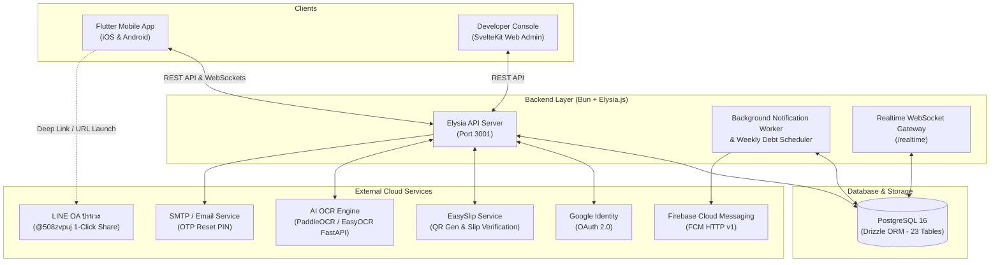

# PingPay — Smart Expense Splitting & PromptPay Settlement Platform

[](https://flutter.dev)
[](https://bun.sh)
[](https://elysiajs.com)
[](https://www.postgresql.org)
[](https://orm.drizzle.team)
[]()

> **ระบบจัดการค่าใช้จ่ายร่วมกันและการชำระเงินผ่านพร้อมเพย์ ด้วยเทคโนโลยี AI & OCR**
> แอปพลิเคชันผู้ช่วยจัดการค่าใช้จ่ายกลุ่ม หารเงิน ติดตามสถานะหนี้ สร้าง PromptPay Dynamic QR ตรวจสอบสลิปโอนเงินธนาคารแบบเรียลไทม์ และระบบแจ้งเตือนอัจฉริยะ

---

## สารบัญ (Table of Contents)
- [เกี่ยวกับโครงงาน (About the Project)](#เกี่ยวกับโครงงาน-about-the-project)
- [ฟีเจอร์เด่นของระบบ (Core Features)](#ฟีเจอร์เด่นของระบบ-core-features)
- [สถาปัตยกรรมระบบ (System Architecture)](#สถาปัตยกรรมระบบ-system-architecture)
- [โครงสร้างโปรเจกต์ (Project Structure)](#โครงสร้างโปรเจกต์-project-structure)
- [เทคโนโลยีที่ใช้ (Tech Stack)](#เทคโนโลยีที่ใช้-tech-stack)
- [การติดตั้งและเริ่มต้นใช้งาน (Getting Started)](#การติดตั้งและเริ่มต้นใช้งาน-getting-started)
- [การทดสอบระบบ (Testing & Quality Assurance)](#การทดสอบระบบ-testing--quality-assurance)
- [ผู้จัดทำโครงงาน (Authors & Credits)](#ผู้จัดทำโครงงาน-authors--credits)

---

## เกี่ยวกับโครงงาน (About the Project)
**PingPay** ถูกออกแบบและพัฒนาขึ้นเพื่อแก้ปัญหาความยุ่งยากในการหารค่าใช้จ่ายร่วมกันในชีวิตประจำวัน เช่น การรับประทานอาหารร่วมกับเพื่อน การเดินทางท่องเที่ยว การแชร์ค่าใช้จ่ายภายในครอบครัว หรือเพื่อนร่วมหอพัก โดยนำเทคโนโลยีสมัยใหม่มาผสานเข้าด้วยกัน:
1. **ลดความผิดพลาดในการคำนวณ**: คำนวณและจัดสรรยอดหนี้ตามสัดส่วนอย่างแม่นยำ พร้อมระบบสมการความสมดุลทางการเงิน (Financial Invariant)
2. **ลดขั้นตอนการกรอกข้อมูล**: สแกนใบเสร็จด้วย AI OCR และรองรับการป้อนข้อมูลด้วยภาษาธรรมชาติ (Natural Language Input - NLI)
3. **ลดความเกรงใจในการทวงเงิน**: ระบบส่งข้อความแจ้งเตือนอัตโนมัติ (Automated Reminders) ทั้งแบบ Push Notification และระบบแจ้งเตือนยอดค้างชำระรายสัปดาห์ (8.9.1)
4. **ความสะดวกในการชำระเงิน**: สร้าง PromptPay Dynamic QR Code ตรงยอดเงินในบิล และตรวจสอบสลิปการโอนเงินธนาคารแบบเรียลไทม์

---

## ฟีเจอร์เด่นของระบบ (Core Features)

### 1. ระบบยืนยันตัวตนและความปลอดภัย (Authentication & Security)
- **Google Sign-In**: เข้าสู่ระบบสะดวกรวดเร็วผ่าน Google Identity OAuth 2.0
- **Onboarding State Machine**: ควบคุมลำดับขั้นตอนการเริ่มต้นใช้งานอย่างเคร่งครัด (`PDPA_REQUIRED` -> `PROFILE_REQUIRED` -> `PIN_REQUIRED` -> `COMPLETED`)
- **PIN Security**: รหัสผ่าน PIN 6 หลักเข้ารหัสด้วย Argon2id พร้อมระบบระงับบัญชีชั่วคราวเมื่อกรอกผิดเกิน 5 ครั้ง
- **Forgot PIN Reset**: รีเซ็ตรหัส PIN ผ่านรหัสยืนยัน OTP 6 หลักทางอีเมล (มีอายุ 15 นาที)
- **Single Active Device Session**: ควบคุมความปลอดภัยให้ใช้งานได้เพียง 1 อุปกรณ์ต่อบัญชี หากล็อกอินจากเครื่องใหม่ ระบบจะบังคับออกจากระบบทันที (`SESSION_TERMINATED`)

### 2. ระบบจัดการโปรไฟล์ ช่องทางการเงิน และเพื่อน (Profile & Friends)
- **Real Name Validation**: ตรวจสอบความถูกต้องของชื่อ-นามสกุลจริงภาษาไทยและอังกฤษ เพื่อใช้จับคู่กับบัญชีธนาคารในสลิป
- **Payment Channels**: ผูกข้อมูล PromptPay (เบอร์มือถือ/บัตรประชาชน), TrueMoney Wallet และบัญชีธนาคาร
- **Friend Management**: ค้นหาและเพิ่มเพื่อนผ่าน User Code และระบบสแกน QR Code พร้อมระบบตั้งชื่อเล่นเฉพาะบุคคล (Custom Nicknames)

### 3. ระบบสร้างบิลและการหารค่าใช้จ่าย (Smart Bill Splitting)
- **AI Receipt OCR**: ถ่ายรูปใบเสร็จเพื่อดึงรายการสินค้า, ราคาแต่ละชิ้น, ภาษี (VAT 7%), ค่าบริการ (Service Charge 10%) และยอดรวมอัตโนมัติ
- **Natural Language Input (NLI)**: ป้อนข้อความภาษาธรรมชาติ เช่น *"กินชาบู 4 คน คนละ 250 รวม 1000"* ระบบจะจัดสรรรายชื่อและยอดเงินให้อัตโนมัติ
- **Original Amount Ceiling Rule**: บันทึกยอดเริ่มต้นถาวร (`originalTotalAmount`) ป้องกันการปรับยอดหนี้เพิ่มเกินจริง
- **Payment Lock Policy**: ล็อคการแก้ไขหรือยกเลิกบิลทันทีเมื่อเริ่มมีการชำระเงินเข้ามาแล้ว (`amountPaid > 0`)

### 4. ระบบการชำระเงินและตรวจสอบสลิป (PromptPay Settlement & EasySlip)
- **Debt Acknowledgement**: ลูกหนี้รูดยืนยันยอมรับภาระหนี้ก่อนทำรายการชำระเงิน
- **Dynamic PromptPay QR**: สร้าง QR Code ชำระเงินมาตรฐาน EMVCo ตรงตามยอดหนี้โดยอัตโนมัติ
- **EasySlip Realtime Verification**: ตรวจสอบความถูกต้องของสลิปโอนเงินธนาคารแบบเรียลไทม์ (ชื่อ-เลขบัญชีผู้รับ, ยอดเงิน, วันเวลา, Ref No.)
- **Anti-Fraud Duplicate Hash Protection**: ตรวจสอบ SHA-256 Hash ของสลิป ป้องกันการใช้สลิปซ้ำซ้อน
- **Multi-Installments & Write-off**: รองรับการผ่อนชำระหลายงวดโดยไม่ทับประวัติเดิม และระบบยกหนี้ให้เพื่อน (Debt Write-off)

### 5. ระบบรายงาน สรุปสถิติ และการแจ้งเตือน (Analytics & Notifications)
- **Monthly & Yearly Analytics**: สรุปยอดรายรับ-รายจ่าย กราฟแท่งเปรียบเทียบ ยอดเฉลี่ยต่อเดือน และหมวดหมู่ค่าใช้จ่าย
- **Daily Financial Timeline**: ปฏิทินไทม์ไลน์บันทึกกิจกรรมการเงินรายวัน
- **1-Click LINE Parnuan Bot Export**: ส่งออกรายการสรุปค่าใช้จ่ายที่ชำระแล้วแยกบรรทัด พร้อมระบุวัน-เวลา และชื่อเล่นเพื่อน เข้าสู่ LINE ป้านวล (`@508zvpuj`) ใน 1 คลิก
- **Automated Weekly Debt Reminders (8.9.1)**: ระบบ Cron/Worker ส่งแจ้งเตือนยอดค้างชำระไปยังลูกหนี้สัปดาห์ละ 1 ครั้ง พร้อมกลไก Deduplication Key ป้องกันการส่งซ้ำ

### 6. ระบบร้านค้าและแลกของรางวัล (Rewards & Gamification)
- **PingPay Points**: รับคะแนนสะสมจากการทำรายการและชำระเงินตรงเวลา
- **Rewards Catalog & Fulfillment**: แลกของรางวัลจริง พร้อมระบบติดตามเลขพัสดุจัดส่ง (Tracking Number)

### 7. ระบบผู้ดูแลระบบและหลังบ้าน (Developer & Admin Console)
- **Web Back-Office**: ติดตามสถิติ GMV ภาพรวม, ตรวจสอบสมุดบัญชีแยกประเภท (`financial_transactions`), จัดการข้อพิพาท, ระงับ/แบนบัญชี, และบรอดแคสต์แจ้งเตือน

---

## สถาปัตยกรรมระบบ (System Architecture)



---

## โครงสร้างโปรเจกต์ (Project Structure)

```
pingpay_mobile/
├── lib/                                    # Flutter Mobile Frontend
│   ├── core/                               # แกนกลางระบบ (Theme, Utils, Services, Network)
│   │   ├── services/                       # FCM Notification, Storage, Slip Scanner
│   │   ├── theme/                          # AppColors, Figma Squircle, Light/Dark Theme
│   │   └── utils/                          # LineShareHelper, Toast, Currency Formatter
│   ├── features/                           # โครงสร้างแยกตามฟีเจอร์ (Clean Architecture)
│   │   ├── analytics/                      # แดชบอร์ดสรุปรายเดือน/รายปี (MonthlySummaryScreen)
│   │   ├── auth/                           # Google Login, Onboarding, PIN Screen, PDPA
│   │   ├── bills/                          # สร้างบิล, AI OCR Scanner, NLI Input, รายละเอียดบิล
│   │   ├── friends/                        # รายชื่อเพื่อน, สแกน QR เพิ่มเพื่อน, ตั้งชื่อเล่น
│   │   ├── notifications/                  # Notification Center, Outbox View
│   │   ├── payments/                       # PromptPay Dynamic QR, ตรวจสลิป, ผ่อนชำระ, ยกหนี้
│   │   └── rewards/                        # แคตตาล็อกของรางวัล, แลกแต้ม, ประวัติจัดส่ง
│   └── main.dart                           # จุดเริ่มต้นแอปพลิเคชัน
├── elysia-api/                             # Backend API (Bun + Elysia.js + Drizzle ORM)
│   ├── src/
│   │   ├── db/                             # schema.ts (23 Tables), migrations, bootstrap
│   │   ├── modules/                        # Business Logic Modules (auth, bills, payments...)
│   │   │   └── notifications/              # FCM v1, Debt Reminder Scheduler, Outbox Worker
│   │   ├── routes/                         # REST API Endpoints (Auto-loaded)
│   │   └── index.ts                        # เซิร์ฟเวอร์หลักและ Background Worker
│   └── tests/                              # Backend Unit & Integration Test Suites
├── developer-console/                      # Web Back-Office Admin (SvelteKit + TailwindCSS)
├── PINGPAY_SYSTEM_SPEC_FOR_DFD.md          # เอกสารคู่มือข้อกำหนดระบบสำหรับเขียน DFD ฉบับสมบูรณ์
└── README.md                               # เอกสารแนะนำโปรเจกต์
```

---

## เทคโนโลยีที่ใช้ (Tech Stack)

| ส่วนประกอบ | เทคโนโลยี | รายละเอียด |
| :--- | :--- | :--- |
| **Mobile App** | **Flutter 3.29+ / Dart** | รองรับทั้ง Android และ iOS, Material Design 3, Figma Squircle |
| **State Management** | **Flutter Riverpod** | การจัดการ State แบบ Reactive และ Dependency Injection |
| **Navigation** | **GoRouter** | ระบบ Routing แบบ Declarative รองรับ Deep Linking |
| **Backend Runtime** | **Bun** | JavaScript/TypeScript Runtime ประสิทธิภาพสูง |
| **Backend Framework** | **Elysia.js** | Web Framework ความเร็วสูง พร้อม TypeBox Validation และ OpenAPI |
| **Database & ORM** | **PostgreSQL 16 / Drizzle ORM** | ฐานข้อมูลเชิงสัมพันธ์พร้อม Schema Type-Safe 23 ตาราง |
| **Receipt OCR** | **FastAPI / PaddleOCR / EasyOCR** | AI สกัดข้อความและตัวเลขจากภาพใบเสร็จ |
| **Settlement & QR** | **EasySlip API (v1 & v2)** | สร้าง Dynamic PromptPay QR และตรวจสอบสลิปธนาคารแบบเรียลไทม์ |
| **Push Notifications** | **Firebase Cloud Messaging (FCM)** | ส่งการแจ้งเตือนระดับระบบผ่าน HTTP v1 API |
| **Back-Office Console** | **SvelteKit / TailwindCSS** | เว็บแผงควบคุมระบบสำหรับผู้ดูแลระบบและนักพัฒนา |

---

## การติดตั้งและเริ่มต้นใช้งาน (Getting Started)

### ความต้องการของระบบ (Prerequisites)
- **Flutter SDK**: `>= 3.29.0`
- **Bun Runtime**: `>= 1.3.0`
- **Node.js**: `>= 20.0.0`
- **PostgreSQL Database**: `>= 16.0`

---

### 1. การติดตั้งและรัน Backend API (`elysia-api`)
```bash
# 1. เข้าสู่โฟลเดอร์ Backend
cd elysia-api

# 2. ติดตั้ง Dependencies
bun install

# 3. ตั้งค่าตัวแปรสภาพแวดล้อม (.env)
cp .env.example .env

# 4. ทำการ Migration ฐานข้อมูล
bun run db:push

# 5. เริ่มต้นรันเซิร์ฟเวอร์
bun dev
```
> เซิร์ฟเวอร์จะเปิดทำงานที่ `http://localhost:3001` พร้อม Swagger Documentation ที่ `http://localhost:3001/docs`

---

### 2. การติดตั้งและรัน Mobile App (`pingpay_mobile`)
```bash
# 1. ติดตั้ง Dependencies ของ Flutter
flutter pub get

# 2. ตรวจสอบความพร้อมของอุปกรณ์
flutter doctor

# 3. รันแอปพลิเคชันบน Emulator หรือ อุปกรณ์จริง
flutter run
```

---

## การทดสอบระบบ (Testing & Quality Assurance)

### รันการทดสอบ Flutter Test Suite (Mobile App)
```bash
flutter test
```
* ครอบคลุมการทดสอบ Unit Tests, Widget Tests, Theme, NLI Parsing, Financial Calculations, และ Screen Flows (88/88 Test Files — 100% Pass)

### รันการทดสอบ Backend Test Suite (Elysia API)
```bash
cd elysia-api
bun test tests/unit/
```
* ครอบคลุมการทดสอบ Authentication State Machine, Password/PIN Security, Slip Hash Deduplication, Weekly Scheduler, และ Invariant Equations

---

## ผู้จัดทำโครงงาน (Authors & Credits)

* **ผู้จัดทำโครงงาน**: นายธนพล พ่ออามาตย์ (Thanapon Phorarmat)
  *นักศึกษาระดับชั้น ปวส.2 อุตสาหกรรมดิจิทัลและเทคโนโลยีสารสนเทศ สาขาวิชาคอมพิวเตอร์โปรแกรมเมอร์ (Software Engineer & DevOps)*
* **ครูที่ปรึกษาหลัก**: นายอดุล ศรีภักดี
* **ครูที่ปรึกษาร่วม**: นางปวันรัตน์ ขันแก้ว, นายวสันต์ น้อยบำรุง
* **สถานศึกษา**: วิทยาลัยเทคนิคนวมินทราชินีมุกดาหาร
